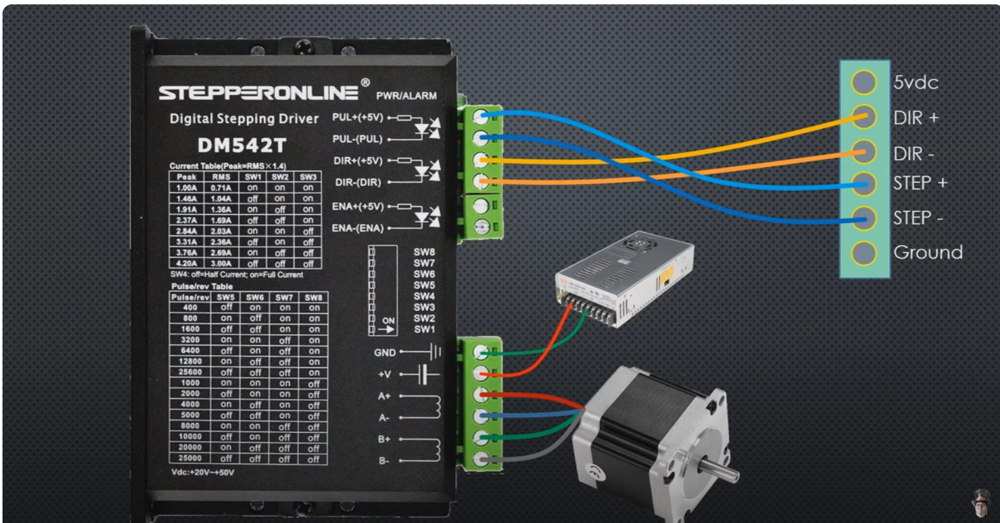
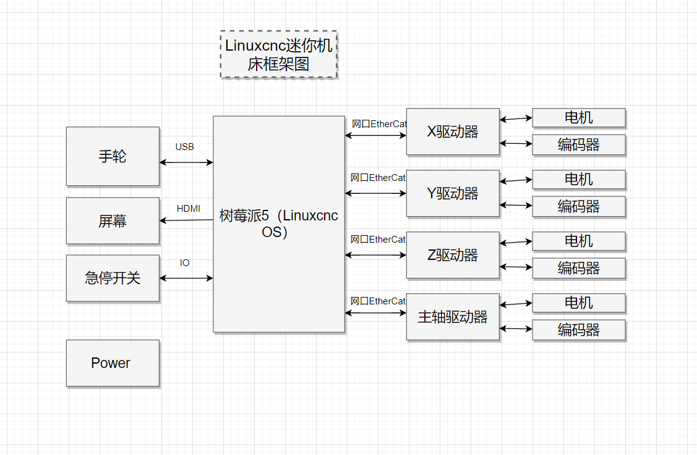

# LinuxCNC迷你机床框架

[LinuxCNC视频教程](https://www.youtube.com/watch?v=_cgC3d_q2n8&list=PLL2ZshSqU4N5c4hTwYOlMqsfk4jI1cKgQ)

## 基本结构
一台迷你机床的主要组成部分分为：机床结构本体；电源；控制板+操作系统；显示器+触摸/键鼠；手轮；急停按钮；电机和驱动器；冷却系统；

## 驱动部分
以三轴机床举例需要X轴电机、Y轴电机、Z轴电机、主轴电机。

### 驱动种类

#### 直接驱动
使用主控板直接控制电机驱动；优点：简单易用；缺点：较难进行高难度控制；

#### 普通控制卡
如mesa控制卡之一（包含5l23，5i20，3x20 4i98）

mesa5i23是PCI总线的通用可编程I/O卡，允许创建几乎任何类型的专用I/O功能，包括FPGA中的软dsp，实时的pci总线带宽达1Gbps，对比百兆以太网是100Mbps。     

[hostmot2](https://github.com/LinuxCNC/hostmot2-firmware)固件是基于上位机的12轴伺服或步进电机控制器。linuxcnc最大支持此固件中的9个轴，且有傻瓜式配置向导，配置过程中此固件被自动载入。支持linuxcnc所有高级特性，包括样条插补，前瞻，运动学（含RTCP）等。可在一台控制系统中同时配置车销和铣削，轴类型，轴数，编码器数，外部I/O可配置。脉冲轴最大10MHZ差分输出。pwm/pdm轴用于带编码器反馈的有刷或无刷电机伺服控制。支持实时手轮，单手轮或每轴一个手轮。支持硬实时性的RTAI内核，基于树莓派等ARM系统的linuxcnc及以太网接口的mesa卡不支持/不直接支持此内核。

[softdmc](https://store.mesanet.com/index.php?route=product/product&product_id=163)固件是基于dsp的4或8轴伺服电机运动控制器（DSP内置在FPGA中），dsp具有100MIPS性能，可在FPGA中完成所有轴的三环控制，驱动pwm驱动器，具有速度和加速度前馈的高级pid算法，摩擦补偿，多轴同步，伺服周期50khz（4轴）25khz（8轴），pci双fifo高速通讯，全部配置和运动命令都在4个16位寄存器中完成，一些应用上可为PMAC，GALIL，TRIO等高端运动控制器的廉价替代品。

使用普通控制卡和电机驱动器接线图。

#### 专用控制卡
[雷赛专用控制卡](https://www.leisai.com/cn/cpzx/info_34_itemid_3194_lcid_1_lcids_133.html)

大致四种组合方式
* 主控板+EtherCat总线式电机驱动器
* 主控板+通用IO控制卡+io电机驱动器
* 主控板+专用控制卡+io电机驱动器
* 主控板+专用控制卡+EtherCat总线式电机驱动器

### 电机种类
电机可选步进电机、交流伺服电机、直流伺服电机；交流伺服供电电压220vAC 直流伺服供电电压为24v DC

驱动能力：交流伺服电机>直流伺服电机>步进电机
调试难度：交流伺服电机>直流伺服电机>步进电机

驱动器可选总线式、Step等
开发难度总线式 < Step式

## 整体框架

选择EtherCat总线式电机驱动器，电机选用步进电机或者直流伺服电机，接线方便、容易调试。

## RTAI Kernels硬实时性内核
